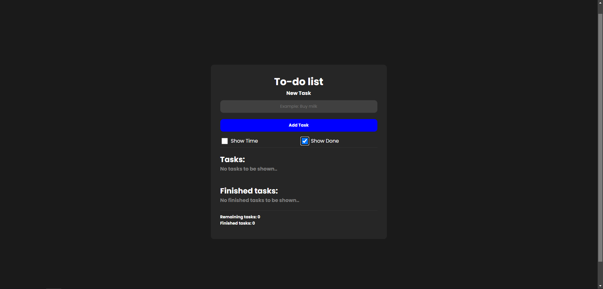
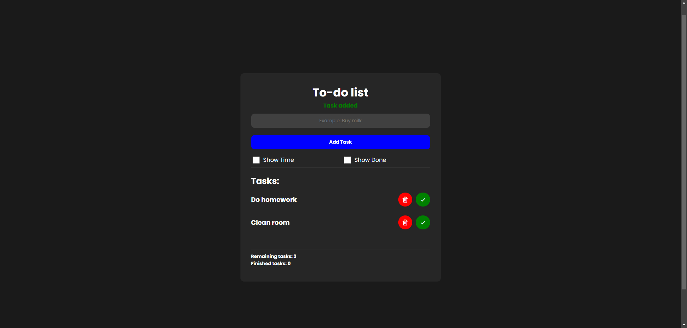
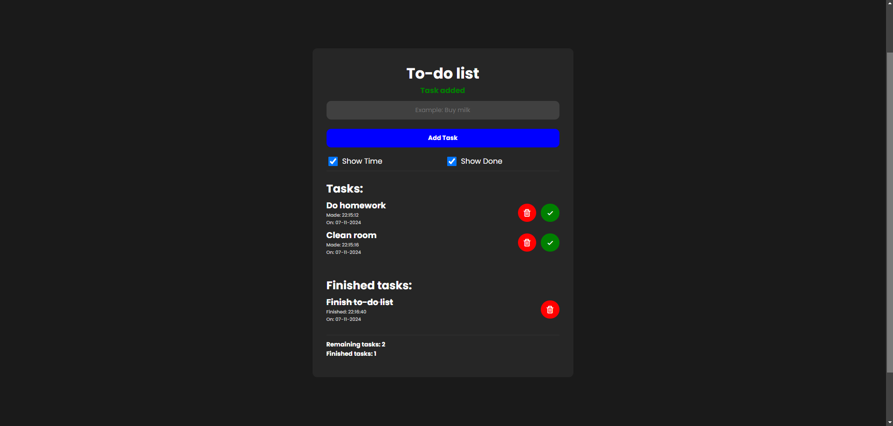

# To-do list
I made a pretty basic to-do list to learn the basics of JavaScript. It includes some simple features, like the option to show completed tasks and the option to display when a task was created or marked as done. Tasks are saved in LocalStorage, so refreshing or closing the page won’t cause losing data or tasks.

Screenshots (click on the image for a larger view):
 
 

 
 

 
 

 
 
